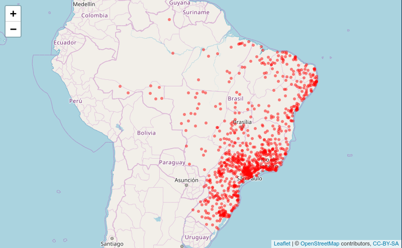

```{r setup, include=FALSE}
knitr::opts_chunk$set(echo = TRUE)
```


```{r echo=FALSE, message=FALSE, warning=FALSE}
library(readr)
library(dplyr)
library(ggplot2)
library(gridExtra)
library(kableExtra)
library(leaflet)
library(magrittr)
library(wordcloud)
library(SnowballC)
library(tm)
library(MASS)
library(nnet)
library(cowplot)
```

```{r echo=FALSE, message=FALSE, warning=FALSE}
olist_classified_public_dataset <- read.csv("dados/olist_classified_public_dataset.csv")
olist_data <- olist_classified_public_dataset

```

## Os Provedores
Os dados a serem utilizados neste relatório foram publicados pela [Olist](https://olist.com/)[^1], uma loja que atua dentro dentro dos marketplaces. É uma grande loja de departamentos dos principais e-commerces do Brasil. Conecta micro, pequenas e médias empresas (PMEs) a esses principais marketplaces por meio de contratos. 

[^1]: https://olist.com/

Os dados são provenientes de transações comerciais reais [^2] envovelndo clientes e vendedores, sendo que a referência aos nomes das empresas vendedoras (parceiros da Olist) foram trocados por nomes de casas de Game of Thrones. 

[^2]: https://www.kaggle.com/olistbr/brazilian-ecommerce#olist_public_dataset_v2.csv

Quando um cliente compra um produto da Olist, o vendedor é notificado para atender ao pedido. Assim que o cliente recebe o produto, ou a data prevista da entrega vence, o cliente recebe uma pesquisa de satisfação por email onde ele pode dar uma nota pela experiência de compra e escrever alguns comentários.

Os datasets estão publicados na plataforma [Kaggle](https://www.kaggle.com)[^3], uma grande comunidade voltada à análise de dados e aprendizado de máquina.

[^3]: https://www.kaggle.com/

## O Dataset

Originalmente, a fonte de dados inclui 6 bases `.csv` distintas, cada qual destinadas a estudos específicos, mas todos são relacionados a eventos de compra em ecommerce pela plataforma Olist . A base utilizada neste relatório corresponde ao arquivo `.csv` de nome `olist_classified_public_dataset_v2`. Nesta base de dados, cada registro corresponde a uma compra de um cliente, referente a um produto e uma análise/crítica. Na tabela 1, vemos um `head()` das 6 primeiras colunas do dataset utilizando o ambiente `kableExtra`[^4]:

[^4]: `kableExtra` auxilia na construção de tabelas complexas e permite encadear o código com o comando `kable` e sintaxa do tipo pipe. Escrito por @kableExtra, encontra-se na versão 0.9.0.

### Variáveis
O dataset é composto por 3,584 linhas e 34 colunas das quais 9 são destinas à composição da coluna `most_voted_class`. O valor dos campos desta coluna refletem o resultado agregado de dados originários de uma pesquisa de satisfação enviada ao cliente após a concretização da compra. Ao responder à pesquisa, o cliente possibilita, por intermádio dos dados, a criação de variáveis "intermediárias", também presentes na base de estudo e identidicadas pelo prefixo `votes_*`. O valor presente nas mesmas é inteiro e corresponde a uma pontuação que varia de 0 a 6. Estas variávies representam a intensidade do evento identificado no nome da coluna correspondente. A definição de cada uma delas é assim dada:

```{r echo=FALSE, message=FALSE, warning=FALSE, fig.align='center', fig.pos='H'}
kable(head(olist_data[,1:6]), 'latex', 
      caption = 'Inspecionando o dataset',
      booktabs = T) %>% 
    kable_styling(position = 'center')
    
```


- **votes_before_estimate**: votos recebidos para entrega antes das mensagens de data estimadas.
- **votos_delayed**: votos recebidos por reclamações atrasadas.
- **votes_low_quality**: votos recebidos por reclamações de baixa qualidade do produto.
- **votes_return**: votos recebidos por desejar devolver o produto às reclamações do vendedor.
- **votes_not_as_anounced**: votos recebidos por produto não como reclamações anunciadas.
- **votes_partial_delivery**: votos recebidos por reclamações de entrega parcial (nem todos os produtos entregues).
- **votes_other_delivery**: votos recebidos para outras reclamações relacionadas à entrega.
- **votes_other_order**: votos recebidos por outras reclamações relacionadas ao pedido.
- **votes_satisfied**: votos recebidos para mensagens satisfeitas pelo cliente.

Baseado no resultado agregado destas variáveis, a primeira variável intermediária, `most_voted_sub_class` é criada. É uma variável categórica cujos níveis são: 

- **antes_prazo**: produto chegou antes do prazo estimado.
- **atrasado**: produto chegou depois do prazo estimado.
- **baixa_qualidade**: produto avaliado como de baixa qualidade.
- **devolucao**: comprador tem a intenção de devolver o produto.
- **diferente_do_anunciado**: em desacordo com o produto anunciado.
- **entrega_parcial**: veio com algum componente faltando.
- **outro_entrega**: será feita uma nova entrega.
- **outro_pedido**: será feito um novo pedido.
- **satisfeito**: comprador satisfeito com o produto.

Por fim, a partir do resultado desta variável é possível gerar a classificação resultante para o campo `most_voted_class`. Em outras palavras, temos a variável resposta . Os valores possíveis são:

- **problemas_de_entrega**
- **problemas_de_qualidade**
- **satisfeito_com_pedido**

As demais variáveis são:

- **index**: coluna de índice.
- **id**: variável inteira que faz referência a linha.
- **order_status**: referência ao status da ordem (delivered, shipped, etc)

```{r echo=FALSE, message=FALSE, warning=FALSE, fig.align='center', fig.width=4, fig.height=2, fig.pos='H'}
## O status das ordens
order_status <- olist_data %>% 
    dplyr::select(order_status) %>% 
    group_by(order_status) %>% 
    summarise(count = n()) %>% 
    arrange(desc(count)) %>% 
    mutate(percent = count/sum(count)) %>% 
    as.data.frame()

#order_status
kable(order_status, 'latex', booktabs = T,
      caption = 'Status das ordens') %>% 
    kable_styling(position = 'center') %>% 
    kable_styling(latex_options = 'hold_position')
```

```{r echo=FALSE, message=FALSE, warning=FALSE, fig.align='center', fig.width=4, fig.height=2, fig.cap='Status das ordens', fig.pos='H'}
ggplot(order_status, aes(x = order_status, y = percent)) +
   geom_histogram(stat = 'identity', color = 'black', fill = 'white') +
   theme(axis.text.x = element_text(angle = 45, hjust = 1, size = 8.5)) +
   theme(axis.text.y = element_text(size = 8.5, hjust = 1)) +
   scale_y_continuous(labels = scales::percent) +
   xlab('') + ylab('')
```

- **order_products_value**: preço total de uma ordem de compra.
- **order_freight_value**: valor total do frete em um pedido.
- **order_sellers_qty**: quantidade total de vendedores que atenderam a um pedido.

```{r echo=FALSE, message=FALSE, warning=FALSE, fig.align='center', fig.width=6, fig.height=3, fig.pos='H' ,fig.cap='Preço, frete e quantidade de vendedores que atenderam uma ordem.'}
## O preço das ordens
order_products_value <- ggplot(olist_data, aes(x = order_products_value)) + 
    geom_histogram(color = 'black', fill = 'white') +
    theme(axis.text.x = element_text(angle = 45, hjust = 1, size = 8.5)) +
    theme(axis.text.y = element_text(size = 8.5, hjust = 1)) +
    theme(axis.title = element_text(size = 9, face="bold")) + 
    xlab('Preço do produto') + ylab('')

## O preço do frete da ordens
order_freight_value <- ggplot(olist_data, aes(x = order_freight_value)) + 
    geom_histogram(color = 'black', fill = 'white') +
    theme(axis.text.x = element_text(hjust = 1, size = 8.5)) +
    theme(axis.text.y = element_text(size = 8.5, hjust = 1)) +
    theme(axis.title = element_text(size = 9, face="bold")) + 
    xlab('Preço do frete') + ylab('')

## Qtd de vendedores que atenderam a uma ordem
order_sellers_qty <- ggplot(olist_data, aes(x = order_sellers_qty)) + 
    geom_histogram(color = 'black', fill = 'white') +
    scale_x_continuous(breaks = scales::pretty_breaks()) +
    theme(axis.text.x = element_text( hjust = 1, size = 8.5)) +
    theme(axis.text.y = element_text(size = 8.5, hjust = 1)) +
    theme(axis.title = element_text(size = 9, face="bold")) + 
    xlab('Qtd. de vendedores') + ylab('')

grid.arrange(order_products_value, order_freight_value, order_sellers_qty, ncol=2)
```

- **order_items_qty**: quantidade total de itens comprados em um pedido.

```{r echo=FALSE, message=FALSE, warning=FALSE, fig.align='center', fig.width=4, fig.height=2, fig.pos='H'}
order_items_qty <- olist_data %>% 
    dplyr::select(order_items_qty) %>% 
    mutate(order_items_qty = as.factor(order_items_qty)) %>% 
    group_by(order_items_qty) %>% 
    summarise(count = n()) %>% 
    mutate(percent = scales::percent(count / sum(count)))
    
#order_items_qty
kable(order_items_qty, 'latex', booktabs = T,
      caption = 'Total de itens') %>% 
      kable_styling(position = 'center') %>% 
      kable_styling(latex_options = 'hold_position')
```

\pagebreak

- **order_purchase_timestamp**: mostra o registro de data e hora da compra.

```{r echo=FALSE, message=FALSE, warning=FALSE, fig.align='center', fig.width=6, fig.height=3}
order_purchase_timestamp <- olist_data %>% 
    dplyr::select(order_purchase_timestamp) %>% 
    mutate(order_purchase_datetime = lubridate::ymd_hms(order_purchase_timestamp),
                              year = lubridate::year(order_purchase_datetime),
                             month = lubridate::month(order_purchase_datetime),
                               day = lubridate::day(order_purchase_datetime),
                              hour = lubridate::hour(order_purchase_datetime)) %>%
    mutate(month = month.abb[month]) %>% 
    dplyr::select(-c(1,2))
```

```{r echo=FALSE, message=FALSE, warning=FALSE, fig.align='center', fig.width=4, fig.height=2, fig.pos='H'}
## Qty de ordens em cada ano
year <- order_purchase_timestamp %>% 
    dplyr::select(year) %>% 
    group_by(year) %>% 
    summarise(count = n()) %>% 
    mutate(percent = scales::percent(count/sum(count))) %>% 
    as.data.frame()
#year

kable(year, 'latex', booktabs = T,
      caption = 'Qtd. de ordens em 2017 e 2018') %>% 
      kable_styling(position = 'center') %>% 
      kable_styling(latex_options = 'hold_position')
```

```{r echo=FALSE, message=FALSE, warning=FALSE, fig.align='center', fig.width=6, fig.height=3, fig.pos='H' , fig.cap='Estatísticas mensais e diárias das ordens de compras.'}
# Qtd de ordens por a cada mês
month <- ggplot(order_purchase_timestamp, aes(x = month)) + 
    geom_histogram(color = 'black', fill = 'white', stat = 'count') +
    scale_x_discrete(limits = month.abb) +
    
    theme(axis.text.x = element_text(size = 8.5)) +
    theme(axis.text.y = element_text( hjust = 1, size = 8.5)) +
    theme(axis.title.y = element_text(size = 8.5)) + 
    
    
    xlab('') + ylab('Ordens')
    
# Qtd de ordens por a cada dia
day <- ggplot(order_purchase_timestamp, aes(x = as.factor(day))) + 
    geom_histogram(color = 'black', fill = 'white', stat = 'count') +
    theme(axis.text.x = element_text(size = 9)) +
    
    theme(axis.text.y = element_text(size = 8.5)) +
    theme(axis.title.y = element_text(size = 8.5)) + 
    
    
    xlab('') + ylab('Ordens')
grid.arrange(month, day, ncol = 1, nrow = 2)
```

- **order_aproved_at**: mostra o carimbo de data / hora da aprovação do pagamento.

```{r  echo=FALSE, message=FALSE, warning=FALSE, fig.align='center', fig.width=6, fig.height=3, fig.pos='H' , fig.cap='Delay médio por UF calculado como a diferença entre as datas de aprovação e ordem de compra. Mato grosso e Acre são os destaques com o menor tempo de aprovação de ordens.'}
## Delay médio por UF entre compra e aprovação do pagamento
# aprove_order_delay <- olist_data %>% 
#     select(order_purchase_timestamp, order_aproved_at, customer_state) %>% 
#     mutate(order_purchase = lubridate::ymd_hms(order_purchase_timestamp),
#              order_aprove = lubridate::ymd_hms(order_aproved_at),
#            delay_in_h = (order_aprove -  order_purchase)/3600) %>% 
#     select(delay_in_h, customer_state)
# mean_approval_delay <- aprove_order_delay %>% 
#     group_by(customer_state) %>% 
#     summarise(mean_delay = mean(delay_in_h))
#     
# ggplot(mean_approval_delay, aes(x = customer_state, y = as.numeric(mean_delay))) + 
#     geom_histogram(color = 'black', fill = 'white', stat = 'identity')

olist_data <- olist_data %>%
    mutate(order_purchase_timestamp = lubridate::ymd_hms(order_purchase_timestamp),
           order_aproved_at = lubridate::ymd_hms(order_aproved_at),
           order_purchase_aprove_delay = round(as.numeric((order_aproved_at -  order_purchase_timestamp)/(60*24)), 3))

mean_approval_delay <- olist_data %>% 
    dplyr::select(order_purchase_aprove_delay, customer_state) %>% 
    group_by(customer_state) %>% 
    summarise(mean_delay = mean(order_purchase_aprove_delay))
    
ggplot(mean_approval_delay, aes(x = customer_state, y = as.numeric(mean_delay))) + 
    geom_histogram(color = 'black', fill = 'white', stat = 'identity') +
    
    theme(axis.text.x = element_text(size = 8.5)) +
    theme(axis.text.y = element_text(size = 8.5)) +
    theme(axis.title.y = element_text(size = 8.5)) +
    
    
    ylab('Delay médio') + xlab('')
```

- **order_estimated_delivery_date**: mostra a data de entrega estimada que foi informada ao - cliente no momento da compra.
- **order_delivered_customer_date**: mostra a data real de entrega do pedido ao cliente.

```{r echo=FALSE, message=FALSE, warning=FALSE, fig.align='center', fig.pos='H', fig.width=5, fig.height=2.5, fig.cap='Comparação entre a estimação do prazo e o erro.'}
#Diff between delivery estimated time and true
# estimated_delivery_error <- olist_data %>%
#     select(order_aproved_at, order_delivered_customer_date, order_estimated_delivery_date) %>%
#     mutate(order_aproved_at = format(as.Date(order_aproved_at), "%Y-%m-%d"),
#            order_delivered_customer_date = format(as.Date(order_delivered_customer_date), "%Y-%m-%d"),
#            order_estimated_delivery_date = format(as.Date(order_estimated_delivery_date), "%Y-%m-%d"),
#            delivery_delay = as.Date(order_delivered_customer_date) - as.Date(order_aproved_at),
#            delivery_estimation_delay = as.Date(order_estimated_delivery_date) - as.Date(order_aproved_at),
#            error =  delivery_estimation_delay - delivery_delay)

# ggplot(estimated_delivery_error, aes(x = delivery_estimation_delay, y = error)) +
#     geom_point()

olist_data <- olist_data %>%
    mutate(order_aproved_at = format(as.Date(order_aproved_at), "%Y-%m-%d"),
           order_delivered_customer_date = format(as.Date(order_delivered_customer_date), "%Y-%m-%d"),
           order_estimated_delivery_date = format(as.Date(order_estimated_delivery_date), "%Y-%m-%d"),
           delivery_delay = as.Date(order_delivered_customer_date) - as.Date(order_aproved_at),
           delivery_estimation_delay = as.Date(order_estimated_delivery_date) - as.Date(order_aproved_at),
           order_delivery_estimation_delay_error =  delivery_estimation_delay - delivery_delay)


ggplot(olist_data, aes(x = delivery_estimation_delay, y = order_delivery_estimation_delay_error)) +
    geom_point(cex = .5) +
    xlab('Prazo estimado (dias)') + 
    ylab('Erro') + 
    theme(axis.title.x = element_text(size = 8.5)) +
    theme(axis.title.y = element_text(size = 8.5)) +
    theme(axis.text.x = element_text(size = 8.5)) +
    theme(axis.text.y = element_text(size = 8.5))
```

- **customer_city**: cidade do cliente
- **customer_zip_code_prefix**: os três primeiros dígitos do código postal do cliente. A figura 6 exibe uma tentativa de construção de visualização espacial de dados com auxilio do pacote `leaflet`. O pacote permite a criação de mapas interativos que podem ser utilizados diretamente do console do R [@leaflet]. Cada ponto no mapa representa uma cidade e uma ordem. A localização de cada ponto se deu por sucessivas chamadas à API de geolocalização *Data Science Toolkit*[^5] pela função `geocode()` do pacote `ggmap`. Este pacote oferece um extenso conjunto de ferramentas que permite acessar conteúdo estático de provedores como Google Maps, OpenStreetMap, entre outros. [@ggmap]

[^5]: http://www.datasciencetoolkit.org/

```{r eval = FALSE, echo = FALSE, warning = FALSE}
bind_geocode <- function(df) {
    lonlat <- data.frame(customer_city = NA, lon = NA, lat = NA)
    
    for (i in 1:nrow(df)) {
        city <- as.character(df[i,1])
        state <- as.character(df[i,2])
        country <- "Brasil"
        q <- paste(city, ', ' , state, ' - ', country, sep = '')
        
        r <- geocode(q, source = 'dsk')
        r <- as.numeric(as.vector(r[1,]))
        v <- c(city, r[1], r[2])
        
        lonlat[i,] <- v
    }
    lonlat
}

customer_location <- olist_data %>% 
    dplyr::select(customer_city, customer_state) %>% 
    distinct(customer_city, customer_state)

#cities_geocodes <- bind_geocode(customer_location)

#write_csv(cities_geocodes, 'cities_geocodes.csv')
```

```{r echo = FALSE, message = FALSE, warning = FALSE}
cities_geocodes <- read_csv('cities_geocodes.csv')

customer_location <- olist_data %>% 
    dplyr::select(customer_city, customer_state) %>% 
    group_by(customer_city) %>% 
    summarise(count = n()) %>% 
    merge(., cities_geocodes, on = 'customer_city')
```

```{r echo=FALSE, message=FALSE, warning=FALSE, out.width='400px', fig.align='center', fig.pos='H' , fig.cap='Visualização espacial da frequência de ordens por cidades brasileiras com utilização do pacote leaflet'}
## Visualização espacial da frquência de compras
brazil_map <- leaflet() %>% 
    addTiles() %>% 
    setView(-55.22, -15.26, zoom = 4) %>% 
    addCircleMarkers(data = customer_location, lng = ~lon, lat = ~lat, popup = ~customer_city,
                     radius = 3,  
                     color = "red",
                     stroke=FALSE,
                     fillOpacity = 0.5)
#brazil_map


```

- **customer_state**: estado / província do cliente

```{r  echo=FALSE, message=FALSE, warning=FALSE, fig.align='center', fig.width=4, fig.height=2, fig.pos='H'}
customer_state <- olist_data %>% 
    dplyr::select(customer_state) %>% 
    group_by(customer_state) %>% 
    summarise(count = n()) %>% 
    arrange(desc(count)) %>% 
    mutate(percent = scales::percent(count/sum(count)))
#customer_state

kable(customer_state, 'latex', booktabs = T,
      caption = 'Frequência de ordens por estado') %>% 
    kable_styling(position = 'center') %>% 
    kable_styling(latex_options = 'hold_position')
```

\pagebreak

- **product_category_name**: a categoria raiz do produto adquirido, em português.

```{r echo=FALSE, message=FALSE, warning=FALSE, fig.align='center', fig.width=6, fig.height=4, fig.pos='H', fig.cap=''}
categories <- olist_data %>% 
    dplyr::select(product_category_name, most_voted_subclass) %>%
    group_by(product_category_name) %>% 
    summarise(count = n()) %>% 
    arrange(desc(count)) %>%    
    mutate(percent = count/sum(count))

categories$product_category_name <- factor(categories$product_category_name, levels = categories$product_category_name)

ggplot(categories, aes(x = product_category_name, y = percent)) +
    geom_histogram(stat = 'identity', color = 'black', fill = 'white') +
    theme(axis.text.x = element_text(angle = 45, size = 7, hjust = 1)) +
    theme(axis.text.y = element_text(size = 8.5)) + 
    scale_y_continuous(labels = scales::percent) +
    xlab('') + ylab('')

#Enjoy yourself discovering the products categories that are more prone to customer insatisfaction.
categories_unsatisfied <- olist_data %>% 
    dplyr::select(product_category_name, most_voted_subclass) %>% 
    filter(most_voted_subclass != '')


categories_unsatisfied <- head(categories,10)

plot_categories_mvclasses <- function() {
    top_categories <-  as.vector(dplyr::pull(categories[1:10,], product_category_name))
    p <- list()
    
    for (i in 1:length(top_categories)) {
        category <- olist_data %>% 
            dplyr::select(product_category_name, most_voted_subclass) %>% 
            filter(product_category_name == top_categories[i]) %>% 
            group_by(most_voted_subclass) %>% 
            summarise(count = n()) %>% 
            arrange(desc(count))
        
        category$most_voted_subclass <- factor(category$most_voted_subclass, levels = category$most_voted_subclass)
        
        gg <- ggplot(category, aes(x = most_voted_subclass, y = count)) +
                ggtitle('Categoria: ', subtitle = top_categories[i]) + 
                geom_histogram(stat = 'identity', color = 'black', fill = 'white') +
                theme(axis.text.x = element_text(angle = 45, hjust = 1, size = 10)) +
                #scale_y_continuous(labels = scales::percent) +
                xlab('') + ylab('')
        #gg
        p[[i]] <- gg
                
    }
    #do.call('grid.arrange', c(list(p), ncol = 2))
    #do.call('grid.arrange', c(p, ncol = 2))
    plot_grid(plotlist = p)
}

#plot_categories_mvclasses()

#as.data.frame(table(categories_unsatisfied$product_category_name))
#table(categories_unsatisfied$product_category_name) %>% as.data.frame() %>% 
#    arrange(desc(Freq))


```

- **product_name_lenght**: número de caracteres extraídos do nome do produto comprado.
- **product_description_lenght**: número de caracteres extraídos da descrição do produto - adquirido.
- **product_photos_qty**: número de fotos publicadas de produtos comprados.

- **review_score**: nota variando de 1 a 5 dada pelo cliente em uma pesquisa de satisfação.

```{r echo=FALSE, message=FALSE, warning=FALSE, fig.align='center', fig.width=6, fig.height=3, fig.pos='H' , fig.cap='Estatísticas do anúncio na seguinte ordem, tamanho do nome em caracteres, tamanho da descrição em caracteres, quantidade de fotos e avaliação obtida.'}

ad_stats <- olist_data %>% 
    dplyr::select(product_name_lenght, product_description_lenght, product_photos_qty, review_score)

product_name_lenght <- ggplot(ad_stats, aes(x = product_name_lenght)) +
    geom_histogram( color = 'black', fill = 'white') +
    xlab('Tamanho do nome') + ylab('') +
    theme(axis.title = element_text(size = 9, face = 'bold')) +
    theme(axis.text = element_text(size = 8.5))
    

product_description_lenght <- ggplot(ad_stats, aes(x = product_description_lenght)) +
    geom_histogram( color = 'black', fill = 'white') +
    xlab('Tamanho da descrição') + ylab('') +
    theme(axis.title = element_text(size = 9, face = 'bold')) +
    theme(axis.text = element_text(size = 8.5))

product_photos_qty <- ggplot(ad_stats, aes(x = product_photos_qty)) +
    geom_histogram( color = 'black', fill = 'white') +
    xlab('Quantidade de fotos') + ylab('') +
    theme(axis.title = element_text(size = 9, face = 'bold')) +
    theme(axis.text = element_text(size = 8.5))

review_score <- ggplot(ad_stats, aes(x = review_score)) +
    geom_histogram( color = 'black', fill = 'white') +
    xlab('Review score') + ylab('') +
    theme(axis.title = element_text(size = 9, face = 'bold')) +
    theme(axis.text = element_text(size = 8.5))

grid.arrange(product_name_lenght, product_description_lenght, product_photos_qty, review_score, ncol = 2)
```

- **review_creation_date**: mostra a data em que a pesquisa de satisfação foi enviada ao cliente.
- **review_answer_timestamp**: mostra o registro de data e hora da resposta da pesquisa de satisfação.

```{r echo=FALSE, message=FALSE, warning=FALSE, fig.align='center', fig.width=4, fig.height=2, fig.pos='H' , fig.cap='Demora para responder a pesquisa de safistação. É a diferença entre a data de envio da pesquisa de satisfação e a data de resposta.'}
# review_answer_delay <- olist_data %>% 
#     select(review_creation_date, review_answer_timestamp) %>% 
#     mutate(review_creation_date = lubridate::ymd_hms(review_creation_date),
#            review_answer_timestamp = lubridate::ymd_hms(review_answer_timestamp),
#            delay = as.numeric(review_answer_timestamp - review_creation_date))
# 
# ggplot(review_answer_delay, aes(x = delay)) +
#     geom_histogram( color = 'black', fill = 'white')

olist_data <- olist_data %>% 
    mutate(review_creation_date = lubridate::ymd_hms(review_creation_date),
           review_answer_timestamp = lubridate::ymd_hms(review_answer_timestamp),
           review_answer_delay = as.Date(review_answer_timestamp) - as.Date(review_creation_date))

ggplot(olist_data, aes(x = review_answer_delay)) +
    geom_histogram( color = 'black', fill = 'white') +
    xlab('Dias') + ylab('Frequência') +
    theme(axis.title = element_text(size = 8.5)) + 
    theme(axis.text = element_text(size = 8.5))
```

- **review_comment_title**: título do comentário da resenha deixada pelo cliente, em - português.
- **review_comment_message**: mensagem de comentário da avaliação deixada pelo cliente, em português. A figura 9 mostra a nuvem de palavras criada com auxilio do pacote `tm` que fornece insfraestrutura para mineração de textos [@tm].

```{r echo=FALSE, message=FALSE, warning=FALSE, fig.align='center', fig.pos='H', fig.cap='Word cloud de palavras mais comuns presentes nos comentários sobre os produtos. Extraído da coluna review.comment.message.'}
review_title_cloud <- olist_data %>% 
    dplyr::select(review_comment_message)

## Calculate Corpus
review_title_cloud_corpus <- Corpus(VectorSource(review_title_cloud$review_comment_message))

## Data cleaning and wrangling
review_title_clean <- tm_map(review_title_cloud_corpus, PlainTextDocument)
review_title_clean <- tm_map(review_title_cloud_corpus, tolower)
review_title_clean <- tm_map(review_title_clean, removeNumbers)
review_title_clean <- tm_map(review_title_clean, removeWords, stopwords("portuguese"))
review_title_clean <- tm_map(review_title_clean, removePunctuation)
review_title_clean <- tm_map(review_title_clean, stripWhitespace)
#review_title_clean <- tm_map(review_title_clean, stemDocument)

wordcloud(review_title_clean, max.words = 200,random.color = TRUE, random.order=FALSE)
# Adding some color
#wordcloud(words = review_title_clean, min.freq = 1,
#          max.words=250, random.order=FALSE, rot.per=0.35, 
#          colors=brewer.pal(8, "Dark2"))
```

\pagebreak

### Modelos e Regressões

#### Regressão Logística Multinomial

Para a criação de um modelo de regressão múltipla, a variável mais interessante seria `most_voted_class`. Neste caso, poderíamos ter uma equação para estimar em que classe se encontra uma ordem de compra com base em um conjunto de variáveis preditoras. Contudo, trata-se de uma variável categórica com 3 níveis.

Uma alternativa é fazer uma regressão logística multinomial (RLM). Trata-se de uma forma de regressão condizuda quando a variável dependente é categórica com mais de dois níveis. É usada para descrever dados e explicar a relação entre uma variável nominal dependente e uma ou mais variáveis independentes contínuas. As variáveis nominais podem ser entendidas como variáveis que não possuem uma ordem intrínsceca. De fato, 
se tomássemos como variável resposta `most_voted_class`, não poderíamos afirmar que existe uma ordem entre os nívies `problemas_de_entrega`, `problemas_de_qualidade`, e `satisfeito_com_pedido`. Desta forma, em teoria, podemos utilizar essa técnica para determinar, dado um conjunto de preditoras -- grupo de variáveis relacionadas ao questionário, por exemplo, em qual classe se encontrará um cliente. Poderíamos utilizar tal modelo para determinar, por exemplo, a probabilidade de um cliente estar `satisfeito_com_pedido` utilizando os dados relativos a sua compra.

Para a realização da análise de regressão nos dados de e-commerce da Olist seguiu-se os procedimentos do tutorial disponível em Analytics Vidhya @mlr.

Após as modelagens, algumas variáveis auxiliares foram criadas, como `order_purchase_aprove_delay`, `delivery_delay`, `delivery_estimation_delay`, `order_delivery_estimation_delay_error`. Abaixo, a função `str()` apresenta a estrutura do dataset resultante onde será aplicada a RLM:

```{r echo=FALSE, message=FALSE, warning=FALSE}
olist_data_mod_reg <- olist_data[,c(4:7, 14, 16:19, 24:32, 35:39, 33, 34)]

olist_data_mod_reg <- olist_data_mod_reg %>% 
    mutate(order_delivery_estimation_delay_error = 
               as.numeric(order_delivery_estimation_delay_error),
           delivery_delay = as.numeric(delivery_delay),
           delivery_estimation_delay = as.numeric(delivery_estimation_delay),
           review_answer_delay = as.numeric(review_answer_delay))
str(olist_data_mod_reg)
    
```

\pagebreak

No *chunk* abaixo vemos a modelagem do dataset utilizando sintaxe pipe do pacote `dplyr` [@dplyr] e aplicação da RLM com utilização do pacote `nnet` [@nnet]:

```{r}
library(nnet)
olist_data_mod_reg <- olist_data_mod_reg %>% 
    filter(most_voted_class != '') 

olist_data_mod_reg$most_voted_class2 <- relevel(olist_data_mod_reg$most_voted_class,
                                               ref = "satisfeito_com_pedido")
rlm <- multinom(most_voted_class ~ ., data = olist_data_mod_reg[,c(9,18,20,           25)])
summary(rlm)
```

A RLM funciona como uma série de regressões logísticas, cada qual comparando dois níveis da variável resposta (`most_voted_class`).

1 - A função `relevel()` renivela os fatores da coluna da variável resposta fazendo com que `satisfeito_com_pedido` seja o fator de referência para as comparações feitas pela função.

2 - A aplicação da RLM neste dataset se dá por meio da função `multinom()` contida no pacote `nnet`, definindo como variável dependente `most_voted_class` e `review_score`, `votes_satisfied` e `delivery_delay` (colunas com índices 9, 18 e 20 respectivamente) como variáveis independentes. A saída da função fornece primeiramente um bloco de informações relacionadas a execução.

3 - São dois os blocos subsequentes na saída do `summary()`, o primeiro com os coeficientes e o próximo com as estatísticas de erros padrão. No bloco *coefficients*, vemos que a primeira linha compara `problemas_de_entrega` com o fator de referência `satisfeito_com_pedido`. A segunda linha compara `problemas_de_qualidade` com o mesmo fator de referência e assim por diante.

Podemos também realizar testes com dados fictícios,

```{r}
dummy_data <- data.frame(review_score = sample(c(1:5),5), 
                         votes_satisfied = sample(c(1:6),5),
                         delivery_delay = sample(c(1:20),5))

pred <- predict(rlm, dummy_data, 'probs')

pred <- as.data.frame(pred) %>% 
    cbind(dummy_data)

pred <- pred[,c(4,5,6,1,2,3)]

pred
```

```{r eval=FALSE, echo=FALSE, message=FALSE, warning=FALSE, fig.align='center', fig.width=4, fig.height=2, fig.pos='H'}
kable(pred, 'latex', booktabs = T,
      caption = 'Teste do modelo com dados alimentados') %>% 
    kable_styling(position = 'center') %>% 
    kable_styling(latex_options = 'hold_position')
```

onde as três primeiras colunas são dados gerados de forma procedural e alimentados no modelo por meio da função `predict()`. Cada linha na tabela representa um cliente ou ordem. Podemos observar a variação da distribuição das probabilidades em relação a classe em que se encontraria o cliente conforme variam suas ações na pesquisa de satisfação e a demora na entrega do produto de modo que,
$$P_{prob.entrega} + P_{prob.qualidade} + P_{satisfeito} = 1$$

#### Estatísticas de validação

Abaixo vemos a saída da tabela de coeficientes e os intervalos de confiança de cada variável preditora:

```{r echo=FALSE}
#Estatísticas de validação do modelo.
z <- summary(rlm)$coefficients / summary(rlm)$standard.errors

p <- (1 - pnorm(abs(z),0,1))*2

exp(coef(rlm))
exp(confint(rlm))

```

No primeiro bloco, cada linha apresenta os coeficientes de regressão multinomial para uma dada classe. O segundo e terceiro blocos contém as estatísticas sobre significância dos coeficiêntes das variáveis preditoras em relação a cada uma das possíveis classes de `most_voted_class`. Os intervalos de confiança assinalados vão de 2.5 % a 97.5 %.

A daterminação da significância da variável preditora na composição do modelo é feita com base na observação do intervalo de confiança. A variável terá significancia apenas se no intervalo de confiança que esteja situada, não apresentar 1 [@Quant_Education_2014]. Neste caso, para `problemas_de_qualidade`, as variáveis significantes são `votes_satisfied` e `delivery_delay`. Para a segunda, incluímos todas as variáveis uma vez que todas são significantes.

Podemos agora comparar as variáveis significantes com os modelos do primeiro bloco e indicar as seguintes generalizações:

- Cada dia à mais de `delivery_delay` impacta inversamente a probabilidade de `problemas_de_qualidade` em comparação com `problemas_de_entrega`.

- Uma unidade de aumento em `votes_satisfied` impacta positivamente a probabilidade de o cliente estar `satisfeito_com_pedido` em comparação com ter tido `problemas_de_entrega`.

- Cada dia à mais de `delivery_delay` impacta inversamente a probabilidade de o cliente estar `satisfeito_com_pedido` em comparação com ter tido problemas na entrega.

- Cada unidade de aumento `satisfeito_com_pedido` aumenta as chances de o cliente estar `satisfeito_com_pedido` em comparação com ter tido `problemas na entrega`.

```{r eval=FALSE, echo=FALSE}
# Multiple Linear Regression
# Dentre as variáveis cujos dados dados são obtidos pela pesquisa de satisfação, `votes_satisfied` representa os votos recebidos pela satisfação do cliente com a negociação. Dado que é uma variável numérica discreta, não há obstáculos que impeçam sua utilização como variável resposta em um modelo de regressão múltipla. Nesse sentido, fez-se a regressão e o output é apresentado a seguir:

olist_data_mod_reg <- olist_data[,c(4:7, 14, 16:19, 24:32, 35:39, 33, 34)]
olist_data_mod_reg <- olist_data_mod_reg %>% 
    mutate(order_delivery_estimation_delay_error = 
               as.numeric(order_delivery_estimation_delay_error))
#mod_reg1 <- lm(votes_low_quality ~ .,
#               data = olist_data_mod_reg[-c(10:18, 20, 24,25)])

mod_reg1 <- lm(votes_satisfied ~ .,
               data = olist_data_mod_reg[-c(1,2,3,5,6,7,8,19,
                                            20,21,23,24,25, 22)])
summary(mod_reg1)

p <- plot(mod_reg1)

#pairs(olist_data_mod_reg[,c(4,9,10,11,12,13,14,15,16,17)])

#mod_reg1 <- stepAIC(mod_reg1, direction = 'both', trace = F)

#summary(mod_reg1)

#plot(mod_reg1)

```

```{r eval=FALSE, echo=FALSE}
olist_data_mlr <- olist_data %>% 
    #select(order_products_value, order_freight_value, order_items_qty, customer_zip_code_prefix,)
    dplyr::select(c(4:7, 14, 16:19, 24:39))

#full.model <- lm(as.numeric(delivery_estimation_delay) ~ ., data = olist_data_mlr[-c(19,20)])
full.model <- lm(review_score ~ ., data = olist_data_mlr[-c(19,20)])
summary(full.model)

step.model <- stepAIC(full.model, direction = 'both', trace = FALSE)
summary(step.model)
#olist_data_mlr <- melt(olist_data_mlr, measure.vars = c(10:18))
#O valor de 0.892 de `Multiple R-squared` demonstra que 89,2% da variabilidade da variável resposta, `votes_satisfied`, pode ser explicada pelo conjunto de variávies no modelo.
```

\pagebreak

## Referências


